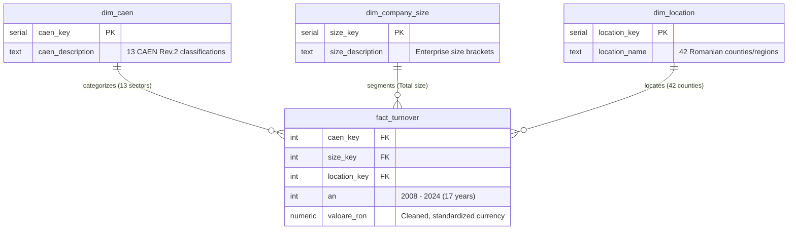

# INSSE Analytics: Romanian National Economy Data Warehouse & Query Optimization

A production-grade PostgreSQL dimensional data warehouse modeling Romanian county-level economic turnover data across 9,279 historical records from the National Institute of Statistics (INSSE). 

The warehouse models **100% of Romania's geographical economy across all 42 administrative divisions (all 41 counties plus Municipiul București)**, spanning 13 primary CAEN Rev.2 industry sectors over 17 continuous years (2008–2024). It features automated ETL sanitization, dynamic currency scale harmonization, advanced windowed analytical CTEs, and execution plan optimization verified via `EXPLAIN ANALYZE`—reducing analytical query latency by **-68.4%** and memory page accesses by **-76.1%**.

---

## Query Optimization Benchmark (`EXPLAIN ANALYZE`)

To evaluate index selectivity and join degradation under multi-predicate filtering and running window aggregations, a heavy analytical stress-test query was executed before and after applying a composite B-tree index on the fact table:

```sql
CREATE INDEX idx_facts ON fact_turnover(location_key, size_key, caen_key, an);
```

### The Stress-Test Cohort
The benchmark query evaluates cumulative running turnover across a targeted cohort of **four western and central counties** (`Timis`, `Arad`, `Sibiu`, `Alba`) and **three high-variance industry sectors** (`Sanatate si Asistenta Sociala`, `Constructii`, `Invatamant`) over a 9-year window (`2016–2024`), producing exactly 108 running-total records. This multi-predicate filter intentionally forces PostgreSQL's cost-based optimizer to decide between a full-table sequential scan with repeated foreign-key lookups versus an index-driven bitmap scan.

### Empirical Plan Comparison

| Performance Metric | Pre-Index Execution | Post-Index Execution (`idx_facts`) | Delta (%) |
| :--- | :--- | :--- | :--- |
| **Execution Latency** | `7.619 ms` | `2.401 ms` | **-68.4%** |
| **Shared Buffer Hits** | `10,825` pages (~86.6 MB) | `2,587` pages (~20.7 MB) | **-76.1%** |
| **Planning Time** | `0.309 ms` | `0.297 ms` | -3.9% |
| **Primary Fact Scan** | `Seq Scan on fact_turnover` (4,914 candidate rows) | `Bitmap Index Scan on idx_facts` | Structural Shift |
| **Join Pipeline Strategy** | 4,914 unindexed nested loop probes | `Memoize` cache node (1,133 hits, 1 miss) | Cache Injection |

```mermaid
flowchart TD
    subgraph PreIndex["Pre-Index Execution (7.619 ms | 10,825 Buffers)"]
        A1["Seq Scan on fact_turnover\n(4,914 candidate rows scanned)"] --> B1["Nested Loop on dim_location_pkey\n(4,914 individual index probes -> 9,828 buffer hits)"]
        B1 --> C1["Nested Loop on dim_caen_pkey\n(468 loops -> 936 buffer hits)"]
        C1 --> D1["In-Memory Quicksort (31 kB) & WindowAgg\n-> 108 running-total rows"]
    end

    subgraph PostIndex["Post-Index Execution (2.401 ms | 2,587 Buffers)"]
        A2["Index Scan on dim_caen\n(3 sector rows identified first)"] --> B2["Bitmap Index Scan on idx_facts\n(Prunes fact candidates directly to 1,134 rows)"]
        B2 --> C2["Memoize Cache on dim_company_size\n(1,133 cache hits / 1 miss at 1 kB memory)"]
        C2 --> D2["Index Scan on dim_location_pkey\n(Reduced to 1,134 probes -> 2,268 buffer hits)"]
        D2 --> E2["In-Memory Quicksort (31 kB) & WindowAgg\n-> 108 running-total rows"]
    end
```



* **Pre-Index Bottleneck ([`results/h_query_pre_index.txt`](sql/insse-analytics/results/h_query_pre_index.txt)):** The unindexed query forced a full sequential table scan across all 9,279 rows followed by **4,914 repeated nested loop lookups** on `dim_location_pkey`. This generated 9,828 shared buffer hits (**90.8% of total query I/O**) solely to evaluate and discard non-target counties.
* **Post-Index Plan ([`results/h_query_post_index.txt`](sql/insse-analytics/results/h_query_post_index.txt)):** The optimizer inverts join order, filters sectors first via `dim_caen`, scans `idx_facts` via a Bitmap Index Scan (slashing fact candidates to 1,134 rows), and engages PostgreSQL's `Memoize` node on company size keys (1,133 cache hits / 1 miss at 1 kB memory), cutting page reads by 8,238 hits.

---

## National Dimensional Architecture (Star Schema)

The warehouse models 9,279 historical records in a conformed Dimensional Star Schema, maintaining strict referential integrity across surrogate primary keys:



* **`fact_turnover`:** Granular fact table storing normalized monetary turnover (`valoare_ron`), annual temporal dimension (`an`), and surrogate foreign keys.
* **`dim_location`:** Complete geographical census of Romania—**all 42 administrative entities** (41 counties plus Bucharest).
* **`dim_caen`:** 13 primary national industry sectors defined under CAEN Rev.2 classifications.
* **`dim_company_size`:** Enterprise classification classes.

---

## Automated Dynamic ETL Pipeline (`03_etl_load.sql`)

Raw data from INSSE contains formatting noise, confidentiality markers (`":"`), missingness tokens (`"-"`), and heterogeneous reporting units. The ETL pipeline sanitizes and scales records dynamically:

1. **Deterministic String Cleansing:**
   `REGEXP_REPLACE(stg.valoare, '[^0-9.]', '', 'g')` removes non-numeric tokens, while `NULLIF(..., '')` converts blank structures into safe database `NULL`s.
2. **Dynamic Scale Harmonization:**
   Historical values are reported inconsistently across Thousands, Millions, and Billions. A conditional scalar unifies every row into base **RON** (`NUMERIC`):
   ```sql
   CASE 
       WHEN stg.unitate_de_masura ILIKE '%Miliarde%' THEN (NULLIF(REGEXP_REPLACE(stg.valoare, '[^0-9.]', '', 'g'), '')::NUMERIC * 1000000000) 
       WHEN stg.unitate_de_masura ILIKE '%Milioane%' THEN (NULLIF(REGEXP_REPLACE(stg.valoare, '[^0-9.]', '', 'g'), '')::NUMERIC * 1000000)
       WHEN stg.unitate_de_masura ILIKE '%Mii%'      THEN (NULLIF(REGEXP_REPLACE(stg.valoare, '[^0-9.]', '', 'g'), '')::NUMERIC * 1000)
       ELSE NULLIF(REGEXP_REPLACE(stg.valoare, '[^0-9.]', '', 'g'), '')::NUMERIC
   END AS valoare_ron
   ```

---

## Macroeconomic Findings & Analytical Engine

The analytics suite ([`sql/insse-analytics/04_analytics_ranking.sql`](sql/insse-analytics/04_analytics_ranking.sql)) extracts macro trends across the 17-year national dataset:

### 1. Macroeconomic Centralization (Top 5 Counties)
Aggregating total turnover reveals severe geographic concentration across Romania ([`results/top_5_counties.csv`](sql/insse-analytics/results/top_5_counties.csv)):

| National Rank | County / Division | Total Historical Turnover (2008–2024) | Share Context |
| :---: | :--- | :--- | :--- |
| **1** | **Municipiul București** | **7,334,364,000,000 RON** (~7.33 Trillion) | National financial and commercial core |
| **2** | **Ilfov** | **1,575,741,000,000 RON** (~1.58 Trillion) | Metropolitan logistics expansion |
| **3** | **Timiș** | **1,165,101,000,000 RON** (~1.17 Trillion) | Western industrial and manufacturing hub |
| **4** | **Cluj** | **1,092,445,000,000 RON** (~1.09 Trillion) | Tech and specialized services center |
| **5** | **Prahova** | **1,092,323,000,000 RON** (~1.09 Trillion) | Industrial processing and energy belt |

*Takeaway:* The top 5 administrative divisions account for over **12.2 Trillion RON**, illustrating disproportionate economic output compared to the remaining 37 counties.

### 2. National Market Share & YoY Trajectory (1,002 Longitudinal Records)
A multi-level CTE evaluates Year-over-Year (YoY) growth and sector-specific national market share for all 42 counties ([`results/market_share_yoy.csv`](sql/insse-analytics/results/market_share_yoy.csv)):
* **Guarded Growth Ratio:** `(total_value - prev_value) / NULLIF(prev_value, 0) AS yoy_growth` prevents zero-division runtime exceptions.
* **Partitioned National Market Share:**
  $$\text{Market Share \%} = \left(\frac{\text{total\_value}}{\sum \text{total\_value} \text{ OVER}(\text{PARTITION BY } \text{an}, \text{caen\_description})}\right) \times 100$$
* **Dense Ranking:** `DENSE_RANK() OVER (PARTITION BY an, caen_description ORDER BY yoy_growth DESC NULLS LAST)`.

---

## Local Replication & Execution

Requires PostgreSQL $\ge$ 14.

```bash
# 1. Create database
createdb -U postgres insse_analytics

# 2. Execute DDL and ETL pipeline chronologically
psql -U postgres -d insse_analytics -f sql/insse-analytics/01_stage_ddl.sql
psql -U postgres -d insse_analytics -f sql/insse-analytics/02_dimensional_ddl.sql
psql -U postgres -d insse_analytics -f sql/insse-analytics/03_etl_load.sql

# 3. Run analytical queries and EXPLAIN ANALYZE benchmarks
psql -U postgres -d insse_analytics -f sql/insse-analytics/04_analytics_ranking.sql
```

---

## Supplementary / Legacy Modules

### [`python/macro-tracker`](python/macro-tracker/)
CLI nutrition and energy expenditure tracking engine built on strict object-oriented domain modeling:
* **OOP Architecture:** Five encapsulated entities (`User`, `Food`, `Meal`, `Day`, `Week`) with dynamic macronutrient portion scaling.
* **Defensive Invariant Validation:** Setter validation explicitly intercepting boolean types (`isinstance(val, bool)`) to block Python's `bool-as-int` subclass coercion bypasses. Bounds exceptions enforce physical limits.
* **Mifflin-St Jeor Engine:** Automates sex-stratified BMR and activity-modified TDEE calculations.
* **Test Suite:** 20 unit tests verified via `pytest` executing in 0.04s.