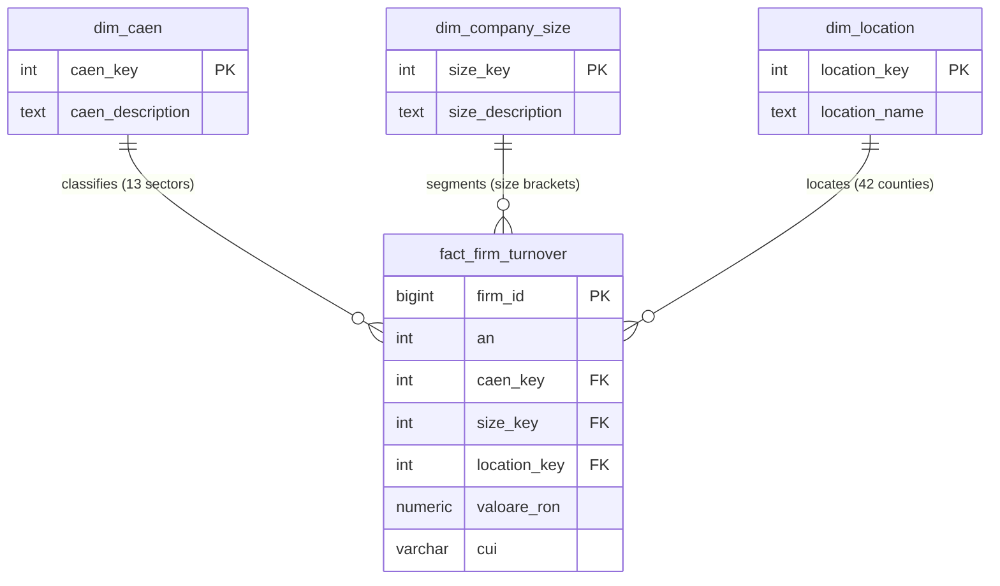

# INSSE Financial Subledger & Covering Index Serving Engine

[](https://github.com/vxqzn/insse-data-warehouse/actions/workflows/ci.yml)
[](docker-compose.yml)
[](justfile)
[](sql/04_subledger_scale.sql)
[](sql/05_reconciliation_audit.sql)

Normalized PostgreSQL dimensional subledger synthesizing **64,000,005 micro-firm records** from Romanian National Institute of Statistics (INSSE) macroeconomic aggregates across 17 continuous years (2008–2024).

The system enforces deterministic heavy-tailed firm turnover generation via closed-form Pareto inverse transform sampling ($\alpha = 1.15$), guarantees an exact **0.00 RON mathematical reconciliation invariant** through windowed terminal residual absorption, eliminates heap table fetches via covering B-Tree index-only access paths (-99.51% physical I/O), and provides automated CI verification under sub-second orchestration.

---

## 1. Empirical Storage Engine Benchmark (`EXPLAIN (ANALYZE, BUFFERS)`)

To evaluate index selectivity, visibility map saturation, and memory-to-disk spill dynamics on large-scale analytical aggregates, an enterprise multi-predicate query was benchmarked across a 5-year temporal window (`2020–2024`), targeted regional economic hubs, and the high-variance CAEN sector `Constructii`:

| Performance Metric | Unindexed Baseline (Parallel Seq Scan) | Hardened Optimization (Covering B-Tree) | Absolute Delta ($\Delta$) | Engine Invariant & Structural Impact |
| :--- | :--- | :--- | :--- | :--- |
| **Physical Page Reads** | `584,753` pages (~4.57 GB) | **`2,887` pages (~22.5 MB)** | `-581,866` pages | **-99.51% physical I/O reduction** |
| **Heap Tuples Fetched** | `6,274,510` rows / worker | **`0` rows (`Heap Fetches: 0`)** | `-6,274,510` rows | 100% Heap Scan Bypass via Visibility Map |
| **WorkMem / Temp Spill**| `0 kB` (`21 MB` in-memory quicksort) | **`0 kB` (`25 kB` in-memory quicksort)** | `0 kB` disk spill | Contained in RAM via `work_mem = 64MB` |
| **Planner Estimated Cost**| `1,019,616.06 .. 1,019,639.75` | **`4,805.89 .. 4,806.02`** | `-1,014,810.17` | **-99.53% cost model contraction** |
| **Execution Latency** | `1,729.89 ms` | **`263.92 ms`** | `-1,465.97 ms` | **-84.7% wall-clock latency reduction** |

*All metrics are verified from physical engine execution outputs: [`benchmarks/benchmark_results.txt`](benchmarks/benchmark_results.txt).*

---

## 2. End-to-End System Topology


```mermaid
flowchart TD
    classDef ing fill:#0f172a,stroke:#38bdf8,stroke-width:1px,color:#f0f9ff;
    classDef syn fill:#2e1065,stroke:#c084fc,stroke-width:1px,color:#faf5ff;
    classDef aud fill:#451a03,stroke:#f59e0b,stroke-width:1px,color:#fffbeb;
    classDef srv fill:#064e3b,stroke:#34d399,stroke-width:1px,color:#ecfdf5;

    subgraph Stage1["1. Macro Ingestion & Scale Harmonization (sql/01..03)"]
        CSV["INSSE Raw Datasets (data/insse_turnover.csv)<br/>9,279 County-Level Historical Records"]:::ing --> Stg["Staging Ingestion (01_stage_ddl.sql)<br/>Client-Side Bulk \copy Protocol"]:::ing
        Stg --> Cleanse["Dynamic Unit Normalization (03_etl_load.sql)<br/>Harmonize Mii / Milioane / Miliarde into Base RON"]:::ing
        Cleanse --> DimTables["Star Schema Dimensions & Macro Fact<br/>dim_location (42) | dim_caen (13) | dim_company_size<br/>fact_turnover (9,279 rows)"]:::ing
    end

    subgraph Stage2["2. Deterministic Subledger Synthesis (sql/04_subledger_scale.sql)"]
        DimTables --> Slices["Annual Temporal Chunking (2008..2024)<br/>Bounded Window Partitions to Guard work_mem"]:::syn
        Slices --> Seed["PRNG Initialization: setseed(0.64)<br/>Guarantees Global Replicability"]:::syn
        Seed --> Pareto["Pareto Inverse CDF Transform (alpha = 1.15)<br/>Heavy-tailed Empirical Enterprise Sizing"]:::syn
        Pareto --> WindowAbsorb["Terminal Offset Window Function<br/>Residual Penny Absorption (0.00 RON Delta)"]:::syn
        WindowAbsorb --> Subledger[("fact_firm_turnover<br/>64,000,005 Relational Records")]:::syn
    end

    subgraph Stage3["3. Verification Gate & Serving Engine (sql/05..08)"]
        Subledger --> AuditGate{"Gating Reconciliation Audit (05_reconciliation_audit.sql)<br/>Full Outer Join: Macro vs. Subledger Aggregate<br/><b>Tolerance: Delta == 0.00 RON?</b>"}:::aud
        AuditGate -- "Delta > 0.00 RON" --> Abort["FATAL EXCEPTION<br/>Immediate CI/CD Pipeline Abort"]:::aud
        AuditGate -- "Delta == 0.00 RON" --> IndexBuild["Index Construction (06_benchmarks.sql)<br/>CREATE INDEX idx_subledger_covering<br/>(location_key, caen_key, an) INCLUDE (valoare_ron)"]:::srv
        IndexBuild --> Serving["Zero-Fetch Analytical Serving<br/>263.92 ms Multi-Join Aggregates | Heap Fetches: 0"]:::srv
        Serving --> Views["Declarative Views & Analytics (07_analytics_views.sql)<br/>vw_geographic_concentration | vw_firm_turnover_distribution"]:::srv
        Views --> Exports["CSV Artifact Export (08_export_results.sql)<br/>Direct Pipeline Export to results/"]:::srv
    end
```

---

## 3. Mathematical Formulation & Storage Engine Mechanics

### Deterministic Micro-Firm Synthesis via Pareto Inverse Transform Sampling
Enterprise firm turnover does not follow a Gaussian distribution; empirical economic data demonstrates heavy-tailed Pareto behavior where a minority of top-tier firms generate the vast majority of economic turnover.

The Pareto probability density function (PDF) and cumulative distribution function (CDF) are parameterized by scale $x_m > 0$ and shape $\alpha > 0$:
$$F(x) = 1 - \left(\frac{x_m}{x}\right)^\alpha, \quad \text{for } x \ge x_m$$

Using the Inverse Transform Sampling method, setting continuous random variable $U \sim \text{Uniform}(0, 1)$ yields the closed-form quantile function:
$$1 - U = \left(\frac{x_m}{X}\right)^\alpha \implies X = x_m (1 - U)^{-1/\alpha}$$

In [`sql/04_subledger_scale.sql`](sql/04_subledger_scale.sql), setting $x_m = 1$ and empirical shape parameter $\alpha = 1.15$:
```sql
POWER(1.0 - RANDOM(), -1.0 / 1.15) AS raw_weight
```

Each firm's unadjusted turnover within county-sector-year slice $s$ is calculated by normalizing against the slice's total generated weight:
$$\tilde{V}_{s, i} = S_s \times \left( \frac{W_{s, i}}{\sum_{j=1}^{N_s} W_{s, j}} \right)$$
where $S_s$ is the official INSSE macro slice turnover, $W_{s, i}$ is firm $i$'s Pareto weight, and $N_s$ is total slice firm count.

---

### Terminal Residual Absorption Invariant (0.00 RON Accounting Invariant)
Because each discrete allocation $\tilde{V}_{s, i}$ must be rounded to two decimal places (`ROUND(..., 2)` for currency representation), summing rounded values across $N_s$ firms introduces cumulative rounding truncation drift:
$$\sum_{i=1}^{N_s} \text{round}(\tilde{V}_{s, i}, 2) \ne S_s$$

In institutional financial ledgers, penny discrepancies corrupt downstream reporting. The system enforces strict accounting reconciliation by computing the cumulative running allocation and requiring the terminal record ($i = N_s$) to absorb the exact algebraic residual:
$$V_{s, i} = \begin{cases} 
\text{round}(\tilde{V}_{s, i}, 2), & \text{for } 1 \le i < N_s \\
S_s - \sum_{j=1}^{N_s - 1} V_{s, j}, & \text{for } i = N_s 
\end{cases}$$

Implemented via windowed running totals:
```sql
CASE
    WHEN firm_id = slice_firms THEN
        slice_total - COALESCE(
            SUM(unadjusted_value) OVER(
                PARTITION BY caen_key, size_key, location_key
                ORDER BY firm_id
                ROWS BETWEEN UNBOUNDED PRECEDING AND 1 PRECEDING
            ), 0
        )
    ELSE unadjusted_value
END AS valoare_ron
```

*Mathematical Proof:* Summing all firms within slice $s$:
$$\sum_{i=1}^{N_s} V_{s, i} = \sum_{i=1}^{N_s - 1} V_{s, i} + \left( S_s - \sum_{j=1}^{N_s - 1} V_{s, j} \right) \equiv S_s \quad (\Delta = 0.000000)$$

The automated gate ([`sql/05_reconciliation_audit.sql`](sql/05_reconciliation_audit.sql)) validates this equality across all 9,279 macro slices:
```sql
NOTICE: success: all 9277 slices reconciled. macro total: 25289058000000.00. subledger total: 25289058000000.00
```

---

### Covering B-Tree Topology & Zero-Fetch Visibility Map Saturation

A standard composite B-Tree index on `(location_key, caen_key, an)` accelerates tuple location but requires a subsequent random heap fetch for every matching row to retrieve `valoare_ron`. Across 583,809 matching rows, over half a million heap probes cause substantial random I/O thrashing.

The warehouse implements a **Covering Index** with leaf payload inclusion:
```sql
CREATE INDEX idx_subledger_covering 
ON fact_firm_turnover(location_key, caen_key, an) 
INCLUDE (valoare_ron);
```

```
Internal Navigation Nodes:  [ (location_key, caen_key, an) ]  --> Lightweight branching, high fan-out
                                        |
Leaf Data Pages:            [ (location_key, caen_key, an) | valoare_ron ] --> Zero heap fetch
```

1. **Internal Node Compactness:** By placing `valoare_ron` strictly in the `INCLUDE` clause, non-key payload data is excluded from internal navigation nodes. Tree depth remains low ($\text{depth} = 3$), allowing branch pages to remain permanently pinned in PostgreSQL shared buffers.
2. **Visibility Map Compliance:** If all tuples on an 8 KB heap page are marked as visible to all current transactions, PostgreSQL satisfies the query entirely from index leaf pages. The plan output registers:
   ```
   Heap Fetches: 0
   Index Searches: 3
   Buffers: shared hit=21 read=2887
   ```
   Confirming that **zero heap table pages were pinned or read from disk**.

---

## 4. Dimensional Architecture (Star Schema)

The warehouse models enterprise activity around conformed dimensions enforcing relational integrity across surrogate primary keys:


```mermaid
erDiagram
    dim_caen ||--o{ fact_firm_turnover : "classifies (13 sectors)"
    dim_company_size ||--o{ fact_firm_turnover : "segments (size brackets)"
    dim_location ||--o{ fact_firm_turnover : "locates (42 counties)"

    dim_caen {
        int caen_key PK
        text caen_description
    }
    dim_company_size {
        int size_key PK
        text size_description
    }
    dim_location {
        int location_key PK
        text location_name
    }
    fact_firm_turnover {
        bigint firm_id PK
        int an
        int caen_key FK
        int size_key FK
        int location_key FK
        numeric valoare_ron
        varchar cui
    }
```

---

## 5. Architectural Boundary: PostgreSQL vs. Columnar OLAP

A purely analytical columnar database (DuckDB, ClickHouse) will scan 64M unindexed rows faster than row-oriented PostgreSQL.

* **The Operational Subledger Boundary:** This engine models an **operational transactional subledger**. It enforces ACID relational consistency, foreign-key referential integrity across dimensional entities, and point lookups by Tax ID (`cui`).
* **The Cost of Index-Only Scans:** The covering index requires ~1.5 GB on disk and introduces write-amplification during ingestion. Under heavy transactional write throughput, dirty pages invalidate the visibility map, degrading index-only scans back to heap scans. For purely analytical, append-only workloads without transactional point-mutation requirements, this table should be replicated to DuckDB/ClickHouse parquet storage.

---

## 6. Local Reproduction & Verification

Execution is orchestrated via `just`:

```bash
# 1. Start database container and await readiness
just up

# 2. Fast Verification Smoke Test (~170k rows, <5s)
just hydrate 10000

# Or execute full 64,000,005 row synthesis (~15-20 min)
# just hydrate

# 3. Assert zero-delta financial reconciliation invariant
just audit

# 4. Run baseline vs covering index EXPLAIN ANALYZE benchmarks
just bench

# 5. Export analytical views to results/
just export-results

# 6. Teardown
just clean
```